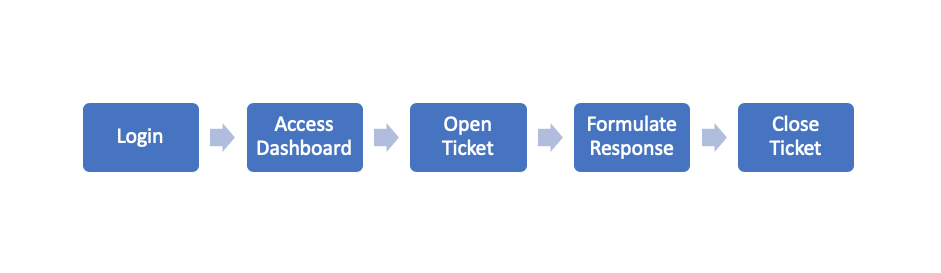

# Help Desk -- Basic Response

## Objective

The goal of this tutorial will be to explain the basic process for responding to a user initiated help desk request, also referred to as a ticket. This tutorial is intended for help desk agents. Agents are individuals assigned the task of monitoring and responding to user requests.

## Basic Workflow









