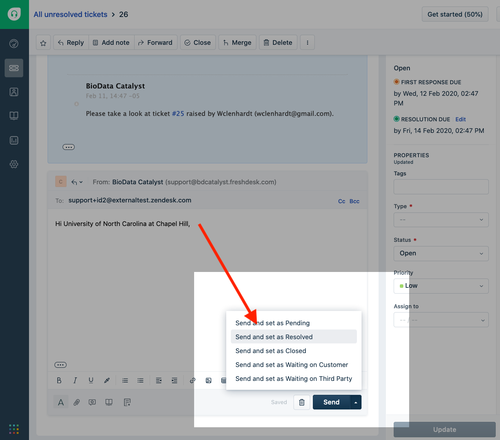

# Resolve / Close Ticket

**"Resolved"** : The Agent or technician believes the issue is resolved

**"Closed"** : The end user has acknowledged that the resolution is to their satisfaction

From the agent perspective, the appropriate selection is to send the reply to the user by choosing the `Send and set as Resolved` option.

