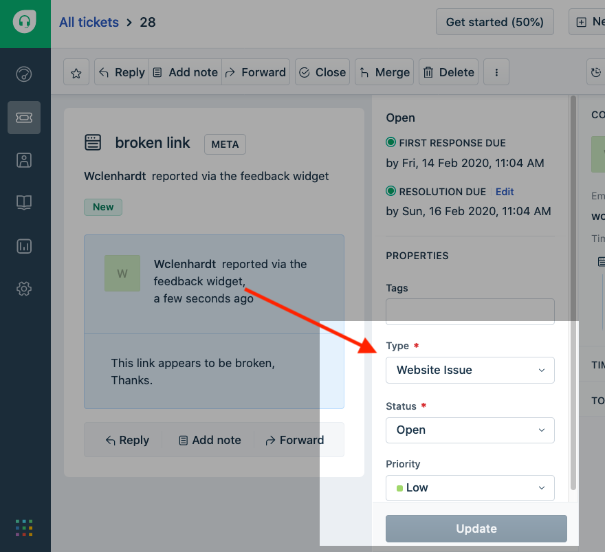
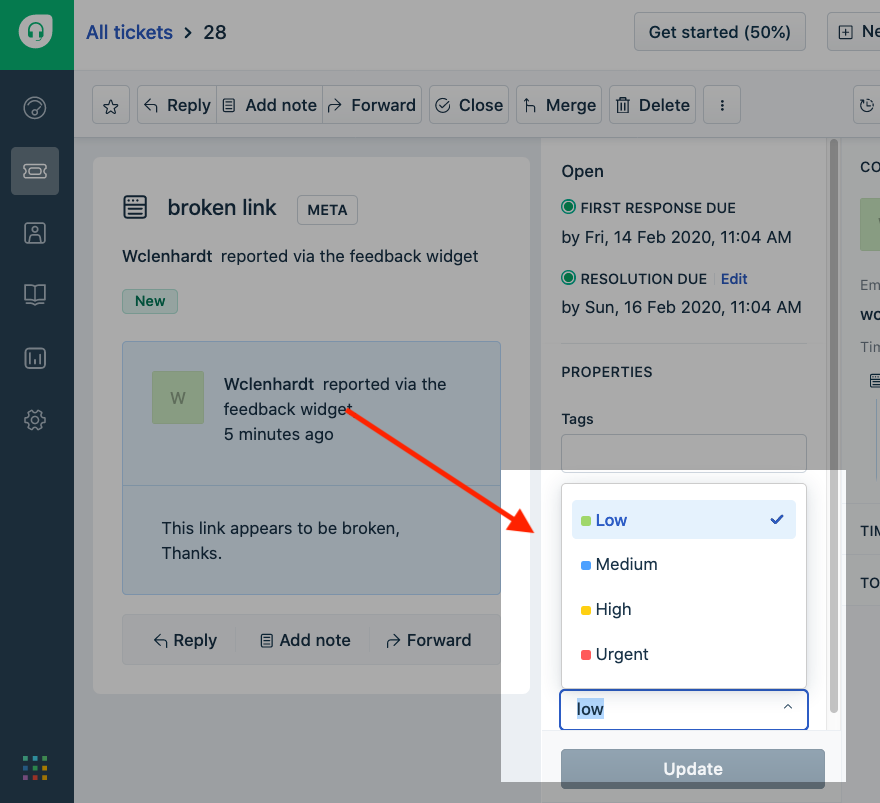

# Review Question Type

Log into the help desk as an agent, select unresolved, and open the relevant ticket.  The issue type will provide an initial indication of how the ticket should be handled.

## Steps

1. Review issue type
2. Review the content of the ticket to assess the priority level.

## Step 1

The issue type can be cross-referenced with the point of contact \(POC\) list to identify the relevant recipient.

## Step 2

Evaluate the nature of the user request and assess the level of urgency. Select the relevant `Priority` from the drop down prior to assigning or fowarding a ticket.

